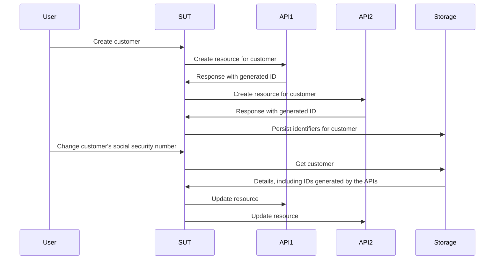

# 不使用 mock、stub 和 spy 进行工作

本章深入探讨测试替身的世界，并探索它们如何影响测试和开发过程。我们将揭示传统 mock、stub 和 spy 的局限性，并介绍一种使用 fake 和契约（contract）的更高效、更具适应性的方法。

## tl;dr

- mock、spy 和 stub 鼓励你在每个测试中临时编码你对依赖行为的假设。
- 这些假设通常除了人工检查之外没有得到验证，因此威胁到测试套件的有用性。
- fake 和契约给我们提供了一种更可持续的方法来创建测试替身，假设经过验证，比替代方案有更好的复用性。

这一章比平常长，所以作为开胃菜，你应该 [先探索一个示例仓库](https://github.com/quii/go-fakes-and-contracts)。特别是，看看 [planner test](https://github.com/quii/go-fakes-and-contracts/blob/main/domain/planner/planner_test.go)。

---

在 [Mocking](https://quii.gitbook.io/learn-go-with-tests/go-fundamentals/mocking) 中，我们学到了 mock、stub 和 spy 是结合 [依赖注入](https://quii.gitbook.io/learn-go-with-tests/go-fundamentals/dependency-injection) 使用、用于控制和检查代码单元行为的有用工具。

不过随着项目的增长，这类测试替身 *可能* 变成维护负担，我们应该转而寻找其他设计思路，让我们的系统易于推理和测试。

**Fake** 和**契约**让开发者能够用更现实的场景测试他们的系统，通过更快、更准确的反馈循环改善本地开发体验，并管理依赖演进的复杂性。

### 测试替身入门

当像我这样的人对测试替身的命名学究气十足时，你很容易翻白眼，但区分不同种类的测试替身有助于我们清晰地讨论这个话题以及我们正在做的权衡。

**测试替身**是各种构建可控依赖的方式的统称，这些依赖供 **被测对象 (SUT)** —— 也就是你正在测试的东西 —— 使用。测试替身通常是比使用真实依赖更好的替代方案，因为它可以避免诸如下列问题：

- 需要互联网才能使用某 API
- 避免延迟和其他性能问题
- 无法触发非 happy-path 的情况
- 把你的构建与另一个团队的构建解耦
  - 你不希望因为另一个团队的工程师不小心提交了一个 bug 而阻止部署

在 Go 中，你通常用接口建模一个依赖，然后实现你自己的版本来在测试中控制行为。**这里是本文涵盖的几种测试替身**。

给定一个假设的 recipe API 的接口：

```go
type RecipeBook interface {
	GetRecipes() ([]Recipe, error)
	AddRecipes(...Recipe) error
}
```

我们可以用各种方式构造测试替身，取决于我们如何尝试测试某个使用 `RecipeBook` 的东西。

**Stub** 每次被调用都返回相同的预设数据

```go
type StubRecipeStore struct {
	recipes []Recipe
	err     error
}

func (s *StubRecipeStore) GetRecipes() ([]Recipe, error) {
	return s.recipes, s.err
}

// AddRecipes omitted for brevity
```

```go
// in test, we can set up the stub to always return specific recipes, or an error
stubStore := &StubRecipeStore{
	recipes: someRecipes,
}
```

**Spy** 类似于 stub，但还会记录它们是怎样被调用的，从而让测试可以断言 SUT 以特定方式调用了依赖。

```go
type SpyRecipeStore struct {
	AddCalls [][]Recipe
	err      error
}

func (s *SpyRecipeStore) AddRecipes(r ...Recipe) error {
	s.AddCalls = append(s.AddCalls, r)
	return s.err
}

// GetRecipes omitted for brevity
```

```go
// in test
spyStore := &SpyRecipeStore{}
sut := NewThing(spyStore)
sut.DoStuff()

// now we can check the store had the right recipes added by inspectiong spyStore.AddCalls
```

**Mock** 是上述的一种超集，但它们只对特定的调用响应特定的数据。如果 SUT 用错误的参数调用依赖，它通常会 panic。

```go
// set up the mock with expected calls
mockStore := &MockRecipeStore{}
mockStore.WhenCalledWith(someRecipes).Return(someError)

// when the sut uses the dependency, if it doesn't call it with someRecipes, usually mocks will panic
```

**Fake** 是依赖的真实版本，但实现方式更适合快速运行、可靠的测试和本地开发。通常你的系统会有某种围绕持久化的抽象，由数据库实现，但在测试中，你可以使用一个内存 fake 来代替。

```go
type FakeRecipeStore struct {
	recipes []Recipe
}

func (f *FakeRecipeStore) GetRecipes() ([]Recipe, error) {
	return f.recipes, nil
}

func (f *FakeRecipeStore) AddRecipes(r ...Recipe) error {
	f.recipes = append(f.recipes, r...)
	return nil
}
```

Fake 之所以有用是因为：

- 它们的有状态性对涉及多个对象和多次调用的测试很有用，比如集成测试。一般不鼓励用其他类型的测试替身管理状态。
- 如果它们有合理的 API，能提供更自然的方式断言状态。比起监视对依赖的特定调用，你可以查询其最终状态以查看你想要的真实效果是否发生。
- 你可以用它们在本地运行你的应用，而无需启动或依赖真实的依赖。这通常会改善开发者体验 (DX)，因为 fake 会比它们的真实对应物更快、更可靠。

Spy、Mock 和 Stub 通常可以使用工具或反射从接口自动生成。然而，由于 Fake 编码了你试图替身的依赖的行为，你必须自己写至少大部分实现

## stub 和 mock 的问题

在 [Anti-patterns](https://quii.gitbook.io/learn-go-with-tests/meta/anti-patterns) 中，有关于使用测试替身必须小心的细节。如果你不能优雅地使用它们，就很容易创建一个混乱的测试套件。但随着项目的成长，其他问题可能会悄悄出现。

当你把行为编码到测试替身中时，你就把你对真实依赖如何工作的假设加入到测试中。如果 double 的行为和真实依赖的行为之间有差异，或者随着时间推移产生了差异（例如，真实依赖发生变化，这是 _必须_ 预期的），**你可能有通过的测试，但软件却失败**。

Stub、spy 和 mock 尤其会带来其他挑战，主要是当项目增长时。为了说明这一点，我会描述我曾经工作过的一个项目。

### 示例案例研究

*与实际发生的相比，一些细节有所改变，并为简洁性而大大简化。**如有雷同，纯属巧合。***

我曾参与过一个系统，它必须调用全球各团队编写和维护的**六个**不同 API。它们是 _类 REST_ 的，而我们系统的工作是在所有这些系统中创建和管理资源。当我们正确地为每个系统调用所有 API 时，_魔法_（业务价值）就会发生。

我们的应用按六边形 / 端口与适配器架构构建。我们的领域代码与必须处理的外部世界混乱解耦。我们的"适配器"实际上是封装了对各种 API 调用的 Go 客户端。


#### 问题

自然地，我们采取了测试驱动的方式构建这个系统。我们利用 stub 模拟下游 API 响应，并有少量验收测试让我们确信一切应该可以工作。

不过，我们必须调用的 API 在大多数情况下：

- 文档很差
- 由有许多其他冲突优先级和压力的团队运营，因此不容易和他们对接时间
- 经常缺乏测试覆盖率，所以会以有趣和意外的方式坏掉、回归等等
- 还在被构建和演进

这导致**大量不稳定测试**和大量头疼。我们 _很大一部分_ 的时间花在 Slack 上联系大量忙碌的人，试图获得以下问题的答案：

- 为什么 API 开始做 `x`？
- 为什么我们做 `y` 时 API 在做不同的事情？

软件开发很少像你希望的那样直接；它是一个学习的过程。我们必须不断学习外部 API 是如何工作的。当我们学习并适应时，我们必须更新和增加我们的测试套件，特别是**改变 stub 来匹配 API 的实际行为**。

问题是，这占用了我们大量的时间，并导致更多错误。当你对依赖的认知发生变化时，你必须找到 **正确** 的测试去更新以改变 stub 的行为，并且有真正的风险忽略在表示同一依赖的其他 stub 中更新它。

#### 测试策略

除此之外，随着系统的增长和需求的变化，我们意识到我们的测试策略不合适。我们有少量验收测试给我们对系统整体工作的信心，然后是对我们写的各个包的大量单元测试。

<u>我们需要介于两者之间的东西</u>；我们经常想要一起改变系统各部分的行为，**但不必为了一个验收测试而启动 _整个_ 系统**。仅靠单元测试无法给我们组件作为整体工作的信心；它们无法讲述（和验证）我们试图实现的故事。**我们想要集成测试**。

#### 集成测试

集成测试证明两个或多个"单元"在组合（或集成！）时正确工作。这些单元可以是你写的代码，或你写的代码与别人代码的集成，比如数据库。

随着项目的增长，你想写更多的集成测试，证明系统的大部分能"挂在一起" —— 或集成！

你可能想写更多的黑盒验收测试，但它们在构建时间和维护成本方面很快就会变得昂贵。当你只想检查系统的一个 *子集*（但不仅仅是单个单元）按预期行为时，启动整个系统可能太昂贵。为你做的每个功能写昂贵的黑盒测试在更大的系统上不可持续。

#### 引入：Fake

问题在于我们单元的测试方式依赖于 stub，而 stub 在大多数情况下是 *无状态* 的。我们想写的测试覆盖多个 *有状态* 的 API 调用，我们可能在开始时创建一个资源，然后在后面编辑它。

下面是我们想做的测试的简化版本。

SUT 是处理"用例"请求的"服务层"。我们想证明，如果创建了一个客户，当他们的详情发生变化时，我们成功地更新了我们在相应 API 中创建的资源。

下面是给团队的需求，作为一个用户故事。

> ***Given*** 一个用户在 API 1、2 和 3 中注册
>
> ***When*** 该客户的社会安全号码被更改
>
> ***Then**,* 该更改传播到 API 1、2 和 3



跨多个单元的测试通常与 stub 不兼容，**因为它们不适合维护状态**。我们 _可以_ 写一个黑盒验收测试，但这些测试的成本很快会失控。

此外，用黑盒测试测试边缘情况很复杂，因为你无法控制依赖。例如，我们想证明如果一个 API 调用失败，回滚机制会被触发。

我们需要使用 **fake**。通过把我们的依赖建模为有状态 API 并配以内存 fake，我们能够写范围更广的集成测试，**让我们能测试真实的用例是有效的**，再次 _无需_ 启动整个系统，而且速度几乎与单元测试一样快。


使用 fake，**我们可以基于各系统的最终状态做断言，而不是依赖于复杂的 spy**。我们会问每个 fake 它持有的客户记录，并断言它们已经更新。这感觉更自然；如果我们手动检查我们的系统，我们会查询那些 API 来检查它们的状态，而不是检查我们的请求日志看是否发送了特定的 JSON 载荷。

```go
// take our lego-bricks and assemble the system for the test
fakeAPI1 := fakes.NewAPI1()
fakeAPI2 := fakes.NewAPI2() // etc..
customerService := customer.NewService(fakeAPI1, fakeAPI2, etc...)

// create new customer
newCustomerRequest := NewCustomerReq{
	// ...
}
createdCustomer, err := customerService.New(newCustomerRequest)
assert.NoErr(t, err)

// we can verify all the details are as expected in the various fakes in a natural way, as if they're normal APIs
fakeAPI1Customer := fakeAPI1.Get(createdCustomer.FakeAPI1Details.ID)
assert.Equal(t, fakeAPI1Customer.SocialSecurityNumber, newCustomerRequest.SocialSecurityNumber)

// repeat for the other apis we care about

// update customer
updatedCustomerRequest := NewUpdateReq{SocialSecurityNumber: "123", InternalID: createdCustomer.InternalID}
assert.NoErr(t, customerService.Update(updatedCustomerRequest))

// again we can check the various fakes to see if the state ends up how we want it
updatedFakeAPICustomer := fakeAPI1.Get(createdCustomer.FakeAPI1Details.ID)
assert.Equal(t, updatedFakeAPICustomer.SocialSecurityNumber, updatedCustomerRequest.SocialSecurityNumber)
```

这比通过 spy 检查各种函数调用参数更简单也更易读。

这种方法让我们的测试可以横跨我们系统的大部分，让我们能写更多关于我们将在站会上讨论的用例的 **有意义的** 测试，同时仍然异常快速地执行。

#### Fake 带来更多封装的好处

在上面的例子中，测试除了验证依赖的最终状态外，并不关心它们的行为。我们创建了依赖的 fake 版本，并把它们注入到我们正在测试的系统部分中。

使用 mock/stub 时，我们必须设置每个依赖来处理某些场景、返回某些数据等。这会把行为和实现细节带入到你的测试中，削弱了封装的好处。

我们把依赖建模在接口背后，这样作为客户端，_我们不必关心它如何工作_，但使用"mockist"方法时，_我们 **在每个测试中** 都必须关心_。

#### Fake 的维护成本

至少在写代码方面，Fake 比其他测试替身昂贵；它们必须携带状态并模拟它们伪装的对象的行为。你的 fake 与真实事物的行为之间的任何差异都**带有风险**，使你的测试与现实不一致。这导致你有通过的测试但软件却坏掉的情况。

每当你与另一个系统集成时，无论是另一个团队的 API 还是数据库，你都会基于其行为做出假设。这些可能从 API 文档、面对面交谈、邮件、Slack 线程等捕获。

如果我们能 **编纂我们的假设**，把它们以可重复且有文档的方式针对我们的 fake _和_ 实际系统运行，看看我们的认知是否正确，岂不是很有帮助？

**契约**就是达到这一目的的手段。它们帮助我们管理对其他团队系统的假设，并使之明确。比邮件交流或无尽的 Slack 线程明确得多、有用得多！


通过有契约，我们可以假设我们能可互换地使用 fake 和实际依赖。这不仅对构造测试有用，对本地开发也有用。

下面是系统所依赖的某个 API 的契约示例

```go
type API1Customer struct {
	Name string
	ID   string
}

type API1 interface {
	CreateCustomer(ctx context.Context, name string) (API1Customer, error)
	GetCustomer(ctx context.Context, id string) (API1Customer, error)
	UpdateCustomer(ctx context.Context, id string, name string) error
}

type API1Contract struct {
	NewAPI1 func() API1
}

func (c API1Contract) Test(t *testing.T) {
	t.Run("can create, get and update a customer", func(t *testing.T) {
		var (
			ctx  = context.Background()
			sut  = c.NewAPI1()
			name = "Bob"
		)

		customer, err := sut.CreateCustomer(ctx, name)
		expect.NoErr(t, err)

		got, err := sut.GetCustomer(ctx, customer.ID)
		expect.NoErr(t, err)
		expect.Equal(t, customer, got)

		newName := "Robert"
		expect.NoErr(t, sut.UpdateCustomer(ctx, customer.ID, newName))

		got, err = sut.GetCustomer(ctx, customer.ID)
		expect.NoErr(t, err)
		expect.Equal(t, newName, got.Name)
	})

	// example of strange behaviours we didn't expect
	t.Run("the system will not allow you to add 'Dave' as a customer", func(t *testing.T) {
		var (
			ctx  = context.Background()
			sut  = c.NewAPI1()
			name = "Dave"
		)

		_, err := sut.CreateCustomer(ctx, name)
		expect.Err(t, ErrDaveIsForbidden)
	})
}
```

正如在 [Scaling Acceptance Tests](https://quii.gitbook.io/learn-go-with-tests/testing-fundamentals/scaling-acceptance-tests) 中讨论的那样，通过针对接口而不是具体类型测试，测试就变得：

- 与实现细节解耦
- 可以在不同上下文中复用。

这正是契约的要求。它让我们能验证和开发我们的 fake _并_ 针对实际实现进行测试。

要创建我们的内存 fake，我们可以在测试中使用契约。

```go
func TestInMemoryAPI1(t *testing.T) {
	API1Contract{NewAPI1: func() API1 {
		return inmemory.NewAPI1()
	}}.Test(t)
}
```

下面是 fake 的代码

```go
func NewAPI1() *API1 {
	return &API1{customers: make(map[string]planner.API1Customer)}
}

type API1 struct {
	i         int
	customers map[string]planner.API1Customer
}

func (a *API1) CreateCustomer(ctx context.Context, name string) (planner.API1Customer, error) {
	if name == "Dave" {
		return planner.API1Customer{}, ErrDaveIsForbidden
	}

	newCustomer := planner.API1Customer{
		Name: name,
		ID:   strconv.Itoa(a.i),
	}
	a.customers[newCustomer.ID] = newCustomer
	a.i++
	return newCustomer, nil
}

func (a *API1) GetCustomer(ctx context.Context, id string) (planner.API1Customer, error) {
	return a.customers[id], nil
}

func (a *API1) UpdateCustomer(ctx context.Context, id string, name string) error {
	customer := a.customers[id]
	customer.Name = name
	a.customers[id] = customer
	return nil
}
```

### 演进的软件

大多数软件不是一次性建好就"完成"的。

它是一个增量的学习练习，适应客户需求和其他外部变化。在示例中，我们调用的 API 也在演进和变化；此外，随着我们开发 _我们_ 的软件，我们更多地了解我们 _真正_ 需要做的系统。我们在契约中做的假设结果是错的，或者 _变成_ 错的。

值得欣慰的是，一旦契约的搭建完成，我们就有了一种处理变化的简单方式。一旦我们因为修复了一个 bug 或同事告知我们 API 正在变化而学到新东西，我们会：

1. 写一个测试来运行新场景。这其中的一部分将涉及更改契约以**驱使**你在 fake 中模拟该行为
2. 运行测试应该失败，但在做任何其他事情之前，针对真实依赖运行契约以确保对契约的更改是有效的。
3. 更新 fake 让它符合契约。
4. 让测试通过。
5. 重构。
6. 运行所有测试并发布。

在签入之前运行 _完整的_ 测试套件 _可能_ 会因为 fake 的行为不同导致其他测试失败。这是**好事**！你现在可以修复系统中所有依赖于已变化系统的其他区域；自信它们也将在生产中处理这种场景。没有这种方法，你必须 _记住_ 找到所有相关的测试并更新 stub。容易出错、费力且无聊。

### 卓越的开发者体验

拥有一套带有相应契约的 fake 感觉像超能力。我们终于可以驯服我们必须处理的 API 的复杂性。

为各种场景写测试变得更简单。我们不再需要为每个测试组装一系列 stub 和 spy；我们可以拿来我们的一组单元或模块（fake、我们自己的"服务"）非常容易地把它们组装起来，运行我们需要的各种奇怪和精彩的场景。

由于临时设置，每个使用 stub、spy 或 mock 的测试都必须 _关心_ 外部系统是如何行为的。另一方面，fake 可以像任何其他封装良好的代码单元一样对待，细节对你隐藏，你可以直接使用它们。

我们可以在本地运行系统的非常真实的版本，并且因为它都在内存中，启动和运行都极快。这意味着我们的测试时间极快，考虑到测试套件多么全面，感觉非常令人印象深刻。

如果我们的验收测试在 staging 环境中失败，我们的第一步是针对我们依赖的 API 运行我们的契约。我们经常在 **其他系统的开发者之前** 识别出问题。

### 用装饰器走出 happy-path

对于错误场景，stub 更方便，因为你可以直接控制它在测试中 _如何_ 行为，而 fake 倾向于相当黑盒。这是有意为之的设计选择，因为我们希望它们的使用者（例如测试）不必关心它们的工作方式；他们应该信任它们做的事情是对的，因为有契约的支撑。

那么我们如何让 fake 失败，以执行非 happy-path 的关注点？

有很多场景，作为开发者，你需要在不改变源代码的情况下修改某些代码的行为。**装饰器模式**通常是一种把一个代码单元加上日志、遥测、重试等的方式。我们可以用它包装我们的 fake，在必要时覆盖行为。

回到 `API1` 示例，我们可以创建一个实现所需接口、围绕 fake 的类型。

```go
type API1Decorator struct {
	delegate           API1
	CreateCustomerFunc func(ctx context.Context, name string) (API1Customer, error)
	GetCustomerFunc    func(ctx context.Context, id string) (API1Customer, error)
	UpdateCustomerFunc func(ctx context.Context, id string, name string) error
}

// assert API1Decorator implements API1
var _ API1 = &API1Decorator{}

func NewAPI1Decorator(delegate API1) *API1Decorator {
	return &API1Decorator{delegate: delegate}
}

func (a *API1Decorator) CreateCustomer(ctx context.Context, name string) (API1Customer, error) {
	if a.CreateCustomerFunc != nil {
		return a.CreateCustomerFunc(ctx, name)
	}
	return a.delegate.CreateCustomer(ctx, name)
}

func (a *API1Decorator) GetCustomer(ctx context.Context, id string) (API1Customer, error) {
	if a.GetCustomerFunc != nil {
		return a.GetCustomerFunc(ctx, id)
	}
	return a.delegate.GetCustomer(ctx, id)
}

func (a *API1Decorator) UpdateCustomer(ctx context.Context, id string, name string) error {
	if a.UpdateCustomerFunc != nil {
		return a.UpdateCustomerFunc(ctx, id, name)
	}
	return a.delegate.UpdateCustomer(ctx, id, name)
}
```

在我们的测试中，我们可以使用 `XXXFunc` 字段来修改测试替身的行为，就像你用 stub、spy 或 mock 一样。

```go
failingAPI1 = NewAPI1Decorator(inmemory.NewAPI1())
failingAPI1.UpdateCustomerFunc = func(ctx context.Context, id string, name string) error {
	return errors.New("failed to update customer")
}
```

然而这 _确实_ 别扭，需要你做出一些判断。用这种方法，你正在失去契约带来的保证，因为你在测试中向 fake 引入了临时行为。

最好检查你的上下文，你可能会得出结论：用 stub 在单元测试级别测试特定的 unhappy-path 会更简单。

### 这不是多余的代码浪费吗？

认为我们应该只写为客户服务的代码，并期望我们能在其上高效构建一个系统，这是一厢情愿的想法。人们对什么是浪费有非常扭曲的看法（见我的文章：[The ghost of Henry Ford is ruining your development team](https://quii.dev/The_ghost_of_Henry_Ford_is_ruining_your_development_team)）。

自动化测试不会直接让客户受益，但我们写它们是为了让自己工作时更高效（你不会为了追求覆盖率分数而写测试，对吧？）。

工程师必须能够轻易地（以可重复的方式，而不是临时的方式）模拟场景以调试、测试和修复问题。**内存中的 fake 和良好的模块化设计让我们能够隔离场景的相关参与者，从而极其廉价地写出快速、合适的测试**。这种灵活性让开发者能以比纠缠不清的混乱更可管理的方式迭代系统，那种混乱要么通过昂贵难写难跑的黑盒测试测试，要么更糟，通过共享环境上的手动测试。

这是 [简单 vs. 容易](https://www.youtube.com/watch?v=SxdOUGdseq4) 的一个例子。当然，短期内 fake 和契约会比 stub 和 spy 写更多代码，但结果是一个更直接、长期维护成本更低的系统。零碎地更新 spy、stub 和 mock 是劳动密集型且容易出错的，因为你没有相应的契约来检查你的测试替身是否正确地行为。

这种方法代表了 _略微_ 增加的前期成本，但在契约和 fake 设置好之后成本会低得多。Fake 比像 stub 这样的临时测试替身更可重用、更可靠。

使用一个已存在的、经过实战检验的 fake 时感觉 _非常_ 解放，并给你 **信心**，比起在写新测试时设置 stub 强得多。

### 这如何融入 TDD？

我不建议 _从_ 契约 _开始_；那是自下而上的设计，一般我发现这需要更聪明，并且有过度思考假设需求的危险。

这种技术与之前章节 [The Why of TDD](https://quii.dev/The_Why_of_TDD) 和 [GOOS](http://www.growing-object-oriented-software.com) 中讨论的"验收测试驱动方法"兼容

- 写一个失败的[验收测试](https://quii.gitbook.io/learn-go-with-tests/testing-fundamentals/scaling-acceptance-tests)。
- 驱动出足够的代码让它通过，这通常会得到某种"服务层"，依赖于一个 API、一个数据库或其他什么。通常你会有通过接口与外部关注点（如持久化、调用数据库等）解耦的业务逻辑代码。
- 一开始用内存 fake 实现接口，让所有测试在本地通过并验证初始设计。
- 要推送到生产环境，你不能用内存版本！把你针对 fake 做的假设编码到契约中。
- 用契约创建实际的依赖，比如 store 的 MySQL 版本。
- 发布。

##  关于测试数据库的章节在哪里？

这是一个我推迟了五年多的常见请求。原因是这一章一直会是我的回答。

<u>不要 mock 数据库驱动并监视调用</u>。这些测试很难写，可能带来的价值很小。你不应该断言是否向数据库发送了特定的 `SQL` 语句，那是实现细节；**你的测试应该只关心行为**。证明特定 SQL 语句被编译 _并不_ 证明你的代码 _按你需要的方式行为_。

**契约**迫使你把测试与实现细节解耦，并专注于行为。

按照上面描述的 TDD 方法，驱动出你的持久化需求。

[示例仓库](https://github.com/quii/go-fakes-and-contracts) 有一些契约的例子，以及它们如何用于测试某些持久化需求的内存和 SQLite 实现。

```go
package inmemory_test

import (
	"github.com/quii/go-fakes-and-contracts/adapters/driven/persistence/inmemory"
	"github.com/quii/go-fakes-and-contracts/domain/planner"
	"testing"
)

func TestInMemoryPantry(t *testing.T) {
	planner.PantryContract{
		NewPantry: func() planner.Pantry {
			return inmemory.NewPantry()
		},
	}.Test(t)
}
```

```go
package sqlite_test

import (
	"github.com/quii/go-fakes-and-contracts/adapters/driven/persistence/sqlite"
	"github.com/quii/go-fakes-and-contracts/domain/planner"
	"testing"
)

func TestSQLitePantry(t *testing.T) {
	client := sqlite.NewSQLiteClient()
	t.Cleanup(func() {
		if err := client.Close(); err != nil {
			t.Error(err)
		}
	})

	planner.PantryContract{
		NewPantry: func() planner.Pantry {
			return sqlite.NewPantry(client)
		},
	}.Test(t)
}
```

虽然 Docker 等让本地运行数据库 _确实_ 更容易，但它们仍然可能带来显著的性能开销。带有契约的 fake 让你能够把使用"重型"依赖的需求限制在仅当你验证契约时，对于其他类型的测试不需要。

为系统的 *其他部分* 的验收和集成测试使用内存 fake，提供更快、更简单的开发者体验。

## 总结

软件项目通常被组织成各团队同时构建系统，试图达成共同目标。

这种工作方式需要高度的协作和沟通。许多人认为通过"API 优先"的方法，我们可以定义一些 API 契约（通常在 wiki 页面上！）然后独立工作六个月再把所有东西拼起来。这在实践中很少奏效，因为我们一旦开始写代码，就会更好地理解领域和问题，这挑战了我们的假设。我们必须对这些知识的变化做出反应，这通常需要跨团队的更改。

所以，如果你处于这种情况，你需要以最佳方式构造和测试你的系统，以应对你正在工作的系统内部和外部的不可预测的变化。

> "软件开发中高效团队的一个决定性特征是他们能够取得进展并改变想法，而无需向他们的小团队之外的任何人或团体请求许可。"
>
> Modern Software Engineering
> David Farley

不要依赖每周会议或 Slack 线程来推敲变化。**把你的假设编码到契约中**。在你的构建流水线中针对系统运行那些契约，这样如果有新信息浮现你就能得到快速反馈。这些契约与 **fake** 一起，意味着你可以独立工作并可持续地管理外部变化。

### 把你的系统当作模块的集合

回到 Farley 的书，我描述的是 **增量主义** 的思想。构建软件是一个 *持续学习的过程*。预先理解我们必须为某个系统解决以传递价值的需求是不现实的。所以，我们必须优化我们的系统和工作方式以 **快速收集反馈并实验**。

你需要一个**模块化系统**才能利用本章讨论的思想。如果你有带有可靠 fake 的模块化代码，它能让你通过自动化测试便宜地实验你的系统。

我们发现把奇怪的、假设性的（但可能的）场景翻译成自包含的测试以帮助我们理解问题极其容易，并通过把模块组合在一起，尝试不同顺序的不同数据，让一些 API 失败等，驱动出更健壮的软件。

定义良好、测试良好的模块让你能够增量发展你的系统，而不必一次改变和理解 _所有_ 东西。

### 但我在做一个有稳定 API 的小项目

即使有稳定的 API，你也不希望你的开发者体验、构建等与他人的代码紧密耦合。当你把这种方法做对时，你最终会得到一组可组合的模块，可以拼接你的系统用于生产、本地运行以及用你信任的测试替身写不同种类的测试。

它让你能够隔离你关心的系统部分，并对你试图解决的真正问题写有意义的测试。

### 让你的依赖成为一等公民。

当然，stub 和 spy 有它们的用武之地。在测试中临时模拟依赖的不同行为永远有它的用处，但要小心不要让成本失控。

在我的职业生涯中，我看过很多次由有才华的开发者写出的精心制作的软件因集成问题而崩溃。集成对工程师来说很有挑战性，_因为_ 很难重现由其他工程师写的、并且也在同时改变的系统的确切行为。

一些团队依靠每个人都部署到共享环境并在那里测试。问题是这不能给你 **隔离的** 反馈，并且**反馈很慢**。你仍然不能构建你的系统如何与其他依赖一起工作的不同实验，至少不能高效地。

**我们必须通过采用更复杂的方式来建模我们的依赖，从而驯服这种复杂性**，以便在它进入生产之前在我们的开发机器上快速测试/实验。创建你依赖的真实的、可管理的 fake，由契约验证。然后，你可以开始写更多有意义的测试并实验你的系统，让你更可能成功。
